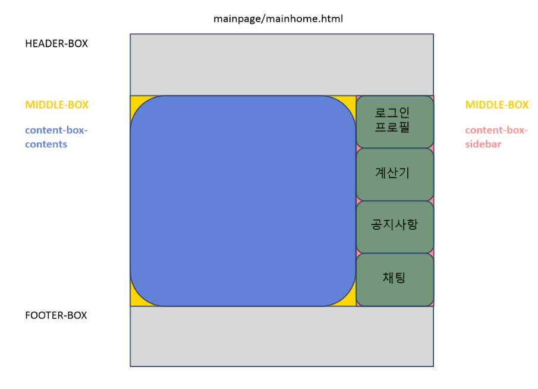
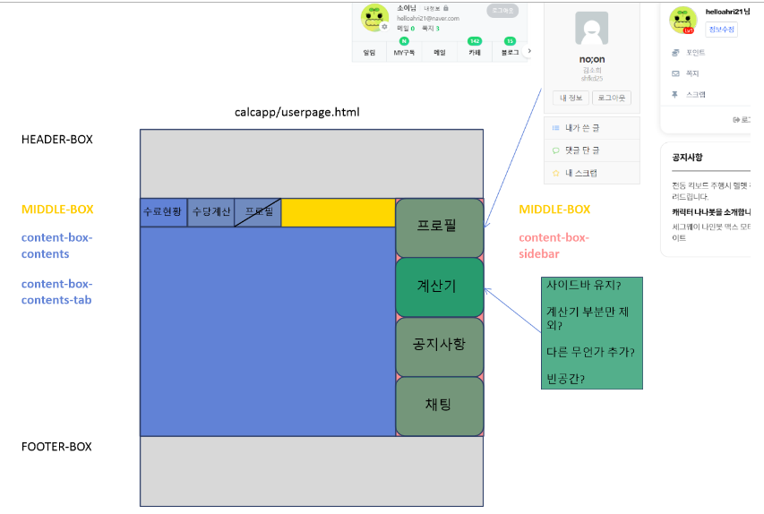
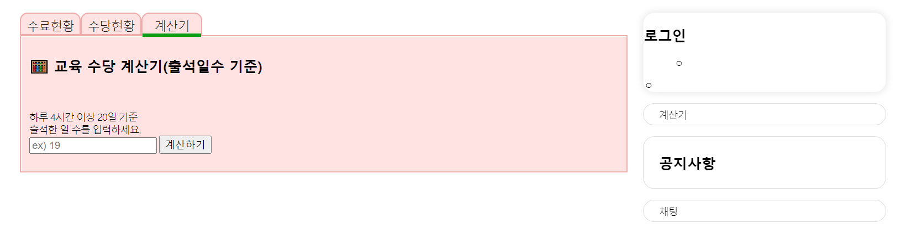

# middlebox Description

## 목표
```
1. 수료현황, 수당계산 페이지
2. middlebox 사이드바
```

## 구상



## 추가 폴더 or 파일
```
static/screens/middlebox.css
static/screens/index.js
templates/mainpage/middlebox.html
```
- middlebox --> 계산기 page

## 결과 화면
- 0630


## 보완 및 의문점
- 계산기 누르고 보이는 페이지에서 사이드바를 유지시키나?
- 유지시킨다면 계산기 부분 제외하나? 남기나?
- 혹은 다른 무언가를 추가하나?

- app 만들어..주.. 셀프계산기 수행되는지 확인 
- db 연동은 추후에?

- 더 나은 구상 혹은 보완, 미흡한 점 대환영